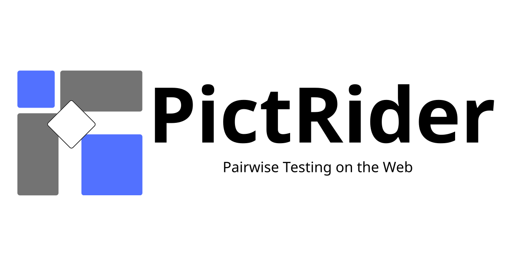

# PictRider



## Pairwise Testing on the Web

PictRider is a modern and user-friendly combinatorial testing tool that allows you to easily generate test cases using pairwise testing techniques directly on the web. It requires no installation and runs entirely in the browser, enabling QA engineers and software developers to quickly and efficiently design effective test cases.

### Features

With PictRider, you can:
- Define test parameters and their possible values
- Create complex constraints between parameters
- Generate optimized test cases that cover all pairwise combinations
- View and export the generated test cases
- And no installation required; get started immediately from your browser

### What is Pairwise Testing?

Pairwise testing is a combinatorial testing technique used to reduce the number of test cases while maintaining high test coverage. It is based on the principle that most defects are caused by interactions between two parameters rather than multiple simultaneous factors.

In this approach, test cases are generated to cover all possible combinations of input values for every pair of parameters. This greatly reduces the total number of tests needed compared to exhaustive testing, while still ensuring that critical interactions are evaluated.

Pairwise testing is especially effective when:
- You need to cover a wide range of parameter combinations
- Full combinatorial testing is impractical due to time or resource constraints
- You want to systematically reduce redundant test cases without sacrificing coverage quality

## Open Source

PictRider is an open-source project. The source code is available on GitHub:

<https://github.com/takeyaqa/PictRider>

Contributions, bug reports, and feature requests are welcome!

## Disclaimer

PictRider is provided "as is", without warranty of any kind, express or implied. In no event shall the authors, contributors, or copyright holders be liable for any claim, damages, or other liability, whether in an action of contract, tort, or otherwise, arising from, out of, or in connection with the software or the use or other dealings in the software.

The test cases generated by PictRider are intended to assist in your testing efforts, but they do *not guarantee complete test coverage* or *the absence of defects* in your software. Users should always apply professional judgment when using testing tools, and are encouraged to supplement pairwise testing with additional testing strategies as appropriate for their specific use case or risk model.

PictRider is an independent project and is not affiliated with Microsoft Corporation. Microsoft PICT is included in accordance with its MIT license terms.

## Microsoft PICT License

PictRider includes and distributes [Microsoft PICT (Pairwise Independent Combinatorial Testing)](https://github.com/microsoft/pict), which is licensed under the MIT License:

```
MIT License

Copyright (c) Microsoft Corporation. All rights reserved.

Permission is hereby granted, free of charge, to any person obtaining a copy
of this software and associated documentation files (the "Software"), to deal
in the Software without restriction, including without limitation the rights
to use, copy, modify, merge, publish, distribute, sublicense, and/or sell
copies of the Software, and to permit persons to whom the Software is
furnished to do so, subject to the following conditions:

The above copyright notice and this permission notice shall be included in all
copies or substantial portions of the Software.

THE SOFTWARE IS PROVIDED "AS IS", WITHOUT WARRANTY OF ANY KIND, EXPRESS OR
IMPLIED, INCLUDING BUT NOT LIMITED TO THE WARRANTIES OF MERCHANTABILITY,
FITNESS FOR A PARTICULAR PURPOSE AND NONINFRINGEMENT. IN NO EVENT SHALL THE
AUTHORS OR COPYRIGHT HOLDERS BE LIABLE FOR ANY CLAIM, DAMAGES OR OTHER
LIABILITY, WHETHER IN AN ACTION OF CONTRACT, TORT OR OTHERWISE, ARISING FROM,
OUT OF OR IN CONNECTION WITH THE SOFTWARE OR THE USE OR OTHER DEALINGS IN THE
SOFTWARE.
```

## PictRider License

PictRider is licensed under the MIT License:

[LICENSE](LICENSE)

## Acknowledgement

PictRider is heavily inspired by **[PictMaster](https://sourceforge.net/projects/pictmaster/)**, a powerful Excel-based tool developed by Iwatsu System & Software Co., Ltd..

We would like to express our respect and appreciation for the ideas, user interface design, and contributions that PictMaster has brought to the field of combinatorial testing.
