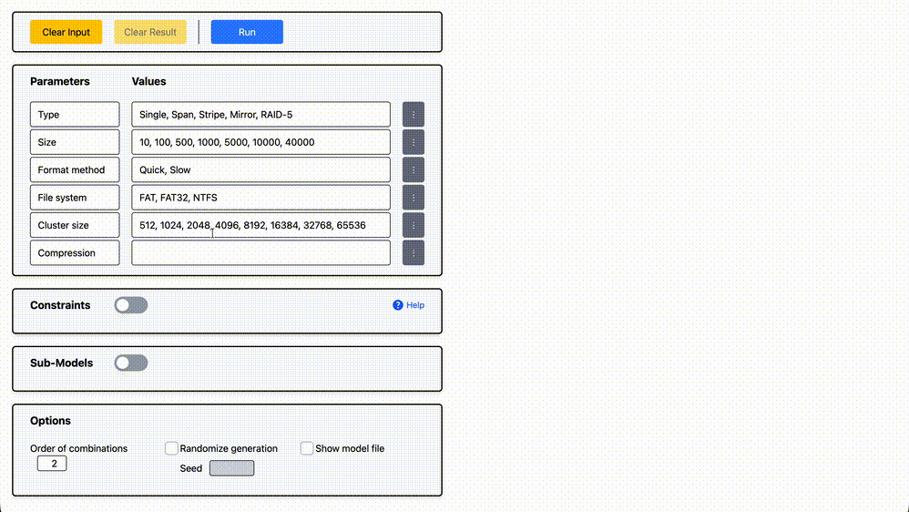

# PictRider

  

## Pairwise Testing on the Web

**PictRider** is a web-based tool for generating pairwise test cases quickly and easily, with no installation required.

### Try it here!

**<https://pictrider.takeyaqa.dev/>**

Using an AI agent for test design? Check out **[PictMCP](https://github.com/takeyaqa/PictMCP#readme)**.

## Features

- 🌐 **No Installation Required** - Get started immediately from your browser
- 🛠️ **User-Friendly Interface** - Intuitive UI for defining parameters, values, and constraints
- ⚡ **WebAssembly Powered** - Fast execution using Microsoft's PICT algorithm compiled to WebAssembly
- 🔗 **Constraint Support** - Define constraints to filter out invalid parameter combinations
- 📤 **Export Results** - View and export the generated test cases

  

## Installation

PictRider is a web application — no installation is required. Just open the link below in your browser:

**<https://pictrider.takeyaqa.dev/>**

PictRider supports the latest versions of modern browsers (Chrome, Firefox, Safari, Edge).

### Install as a PWA

PictRider also supports installation as a Progressive Web App (PWA) for offline access and a native app-like experience. In Chrome or Edge, click the install icon in the address bar, then click "Install".

## FAQ

### I already use the `pict` CLI. Do I need this?

If you prefer a web-based interface without the need for installation or command-line usage, PictRider provides a user-friendly way to generate pairwise test cases directly in your browser, making it accessible for those who may not be comfortable with command-line tools.

### What is pairwise testing?

Pairwise testing (also known as all-pairs testing) is a combinatorial testing method that generates test cases covering all possible pairs of input parameters. This significantly reduces the number of test cases while maintaining high defect detection rates.

### What constraint syntax is supported?

PictRider supports the full PICT constraint syntax. See the [PICT documentation](https://github.com/microsoft/pict/blob/main/doc/pict.md) for details.

## Privacy

PictRider uses [Plausible Analytics](https://plausible.io/) for basic, privacy-friendly website analytics. Plausible does not use cookies and collects only minimal, anonymized usage data; IP addresses are not stored and data is aggregated. See [Plausible's privacy documentation](https://plausible.io/privacy-focused-web-analytics) for details.

All test case generation is performed locally in your browser using WebAssembly. Your input data is never sent to any server.

When installed as a PWA, analytics are completely disabled.

## License

This project is licensed under the MIT License—see the [LICENSE](./LICENSE) file for details.

## Disclaimer

PictRider is provided "as is", without warranty of any kind. The authors are not liable for any damages arising from its use.

Generated test cases do _not guarantee complete coverage_ or _the absence of defects_. Please supplement pairwise testing with other strategies as appropriate.

PictRider is an independent project and is not affiliated with Microsoft Corporation.

## Acknowledgements

PictRider is heavily inspired by **[PictMaster](https://sourceforge.net/projects/pictmaster/)**, a powerful Excel-based tool developed by Iwatsu System & Software Co., Ltd.

We would like to express our respect and appreciation for the ideas, user interface design, and contributions that PictMaster has brought to the field of combinatorial testing.
