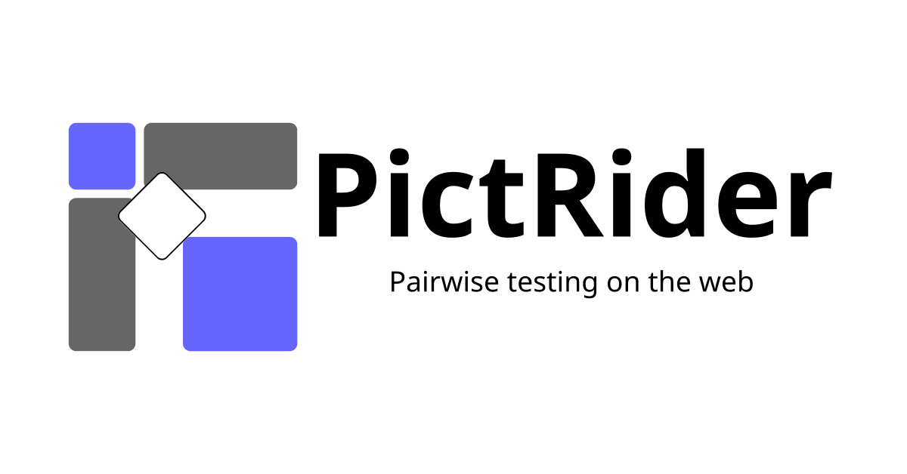

# PictRider

  

## Pairwise Testing on the Web

**PictRider** is a web-based tool for generating pairwise test cases quickly and easily, with no installation required.

### Try it here!

**<https://pictrider.takeyaqa.dev/>**

Using an AI agent for test design? Check out [PictMCP](https://github.com/takeyaqa/PictMCP).

### Features

With PictRider, you can:

- 📝 Define test parameters and their possible values
- 🔗 Create complex constraints between parameters
- ✨ Generate optimized test cases that cover all pairwise combinations
- 📤 View and export the generated test cases
- 🌐 And no installation required; get started immediately from your browser
- ⚡ Fast execution using the PICT algorithm compiled to WebAssembly

### What is Pairwise Testing?

_Pairwise testing_ is a combinatorial testing technique used to reduce the number of test cases while maintaining high test coverage. It is based on the principle that most defects are caused by interactions between two parameters rather than multiple simultaneous factors.

In this approach, test cases are generated to cover all possible combinations of input values for every pair of parameters. This greatly reduces the total number of tests needed compared to exhaustive testing, while still ensuring that critical interactions are evaluated.

Pairwise testing is especially effective when:

- You need to cover a wide range of parameter combinations
- Full combinatorial testing is impractical due to time or resource constraints
- You want to systematically reduce redundant test cases without sacrificing coverage quality

## Open Source

PictRider is an open-source project. The source code is available on GitHub:

<https://github.com/takeyaqa/PictRider>

## Disclaimer

PictRider is provided "as is", without warranty of any kind, express or implied. In no event shall the authors, contributors, or copyright holders be liable for any claim, damages, or other liability, whether in an action of contract, tort, or otherwise, arising from, out of, or in connection with the software or the use or other dealings in the software.

The test cases generated by PictRider are intended to assist in your testing efforts, but they do _not guarantee complete test coverage_ or _the absence of defects_ in your software. Users should always apply professional judgment when using testing tools, and are encouraged to supplement pairwise testing with additional testing strategies as appropriate for their specific use case or risk model.

PictRider is an independent project and is not affiliated with Microsoft Corporation.

## Acknowledgement

PictRider is heavily inspired by **[PictMaster](https://sourceforge.net/projects/pictmaster/)**, a powerful Excel-based tool developed by Iwatsu System & Software Co., Ltd..

We would like to express our respect and appreciation for the ideas, user interface design, and contributions that PictMaster has brought to the field of combinatorial testing.
